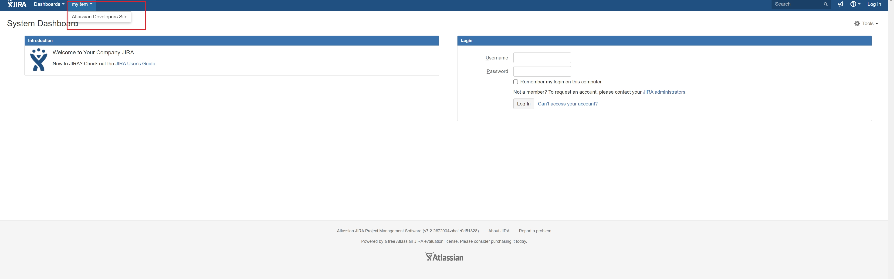

Source code for:

https://developer.atlassian.com/display/DOCS/Set+up+the+Atlassian+Plugin+SDK+and+Build+a+Project

The files we looked at in this tutorial were:

- pom.xml
- /src/main/resources/atlassian-plugin.xml

jira安装包： https://www.atlassian.com/software/jira/update

-------------------------------------------------------------------------------------
### 准备开发环境
#### 1.安装Atlassian SDK

* Windows：https://developer.atlassian.com/server/framework/atlassian-sdk/install-the-atlassian-sdk-on-a-windows-system/
* Linux or Mac：https://developer.atlassian.com/server/framework/atlassian-sdk/install-the-atlassian-sdk-on-a-linux-or-mac-system/

##### 2.配置项目环境
#### idea项目配置
* 进入File | Settings | Build, Execution, Deployment | Build Tools | Maven菜单下

* 设置Maven home path 为 Atlassian SDK 下的 maven，例如： D:/install/Atlassian/atlassian-plugin-sdk-8.2.7/apache-maven-3.5.4

* User settings file 为 Atlassian SDK 下的 maven 的 settings.xml 文件，例如： D:\install\Atlassian\atlassian-plugin-sdk-8.2.7\apache-maven-3.5.4\conf\settings.xml
#### jdk版本
1.8

### 运行命令

* atlas-run   -- installs this plugin into the product and starts it on localhost
* atlas-debug -- same as atlas-run, but allows a debugger to attach at port 5005
* atlas-help  -- prints description for all commands in the SDK
* atlas-run --product jira --version 6.1
* pom文件已经配置`<enableQuickReload>true</enableQuickReload>`，在插件运行时，可直接修改代码，运行atlas-mvn package即可部署

